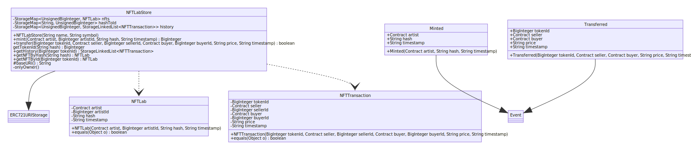

# NFTLab smart contract in Hotmoka

[](https://github.com/NFT-Lab/smart-contract-hotmoka/actions/workflows/build.yml)

La seguente repository contiene lo smart contract per Hotmoka per la gestione della compra vendita di NFT nella piattaforma NFTLab.

## Strumenti utilizzati

* **[Maven](https://maven.apache.org/).**
* **[JUnit5](https://junit.org/junit5/):** libreria per la scrittura di test nel linguaggio java.

## Prerequisiti

1. Creare un token personale che permetta la lettura di pacchetti da github ([la guida qui](https://docs.github.com/en/github/authenticating-to-github/keeping-your-account-and-data-secure/creating-a-personal-access-token)).

2. Creare il file **settings.xml** dentro la cartella **~/.m2** con il seguente contenuto:

   ```xml
   <settings xmlns="http://maven.apache.org/SETTINGS/1.0.0"
     xmlns:xsi="http://www.w3.org/2001/XMLSchema-instance"
     xsi:schemaLocation="http://maven.apache.org/SETTINGS/1.0.0
                         http://maven.apache.org/xsd/settings-1.0.0.xsd">
   
     <activeProfiles>
       <activeProfile>github</activeProfile>
     </activeProfiles>
   
     <profiles>
       <profile>
         <id>github</id>
         <repositories>
           <repository>
             <id>central</id>
             <url>https://repo1.maven.org/maven2</url>
           </repository>
           <repository>
             <id>github</id>
             <url>https://maven.pkg.github.com/NFT-Lab/*</url>
             <snapshots>
               <enabled>true</enabled>
             </snapshots>
           </repository>
         </repositories>
       </profile>
     </profiles>
   
     <servers>
       <server>
         <id>github</id>
         <username>$GITHUB_USERNAME</username>
         <password>$ACCESS_TOKEN</password>
       </server>
     </servers>
   </settings>
   ```

   In questo modo si permetterà a maven di accedere alla repository maven di github.

## Organizzazione della repository

```bash
├── gameteED25519.keys
├── gameteQTesla.keys
├── gameteSHA256DSA.keys
├── LICENSE
├── pom.xml
├── README.md
└── src
    ├── main
    │   ├── java
    │   │   ├── io
    │   │   │   └── nfteam
    │   │   │       └── nftlab
    │   │   │           └── nftlabstore
    │   │   │               ├── NFTLab.java
    │   │   │               ├── NFTLabStore.java
    │   │   │               └── NFTTransaction.java
    │   │   └── module-info.java
    │   └── resources
    └── test
        └── java
            └── io
                └── nfteam
                    └── nftlab
                        └── nftlabstore
                            ├── NFTLabStoreTest.java
                            ├── NFTLabTest.java
                            ├── NFTTransactionTest.java
                            └── TakamakaTest.java

```

### Package io.nfteam.nftlab



#### NFTLabStore

##### Costruttori

- **NFTLabStore(String name, String symbol):** costruisce il contratto assegnando un nome ed un simbolo per il NFT.

##### Eventi

- **Minted**: evento che segnala la creazione di un nuovo NFT.
- **Transferred**: evento che segnala il trasferimento di un NFT da un wallet ad un altro.

##### Metodi

- **mint(Contract artist, BigInteger artistId, String hash, String timestamp):** permette la creazione di un nuovo NFT
  - **View:** false
- **transfer(BigInteger tokenId, Contract seller, BigInteger sellerId, Contract buyer, BigInteger buyerId, String price, String timestamp):** permette di trasferire un NFT da un wallet ad un altro
  - **View:** false
- **getTokenId(String hash) BigInteger:** permette di ottenere l'id di un NFT a partire dal suo hash
- **getHistory(BigInteger tokenId) StorageLinkedList\<NFTTransaction\>:** permette di ottenere la storia delle transazioni di un NFT a partire dal suo ID
  - **View:** true
- **getNFTByHash(String hash) NFTLab:** permette di ottenere un NFT a partire dal suo hash
  - **View:** true
- **getNFTById(BigInteger id) NFTLab:** permette di ottenere un NFT a partire dal suo id
  - **View:** true
- **onlyOwner:** permette l'esecuzione del metodo solamente al proprietario del contratto

#### NFTLab

La classe NFTLab consiste in un NFT.

#### NFTTransaction

La classe NFTTransaction consiste in una transazione di un NFT.

### Test

Tutti i test sono stati implementati attraverso la libreria **JUnit5**.

Per aiutare la scrittura dei test in Takamaka è stata utilizzata la classe TakamakaTest, la quale ha il compito di creare un nodo temporaneo e interagire con la blockchain Hotmoka attraverso i seguenti metodi:

* **addJarStoreInitialTransaction**
* **addJarStoreTransaction**
* **addConstructorCallTransaction**
* **addInstanceMethodCallTransaction**
* **addStaticMethodCallTransaction**
* **runInstanceMethodCallTransaction**
* **runStaticMethodCallTransaction**
* **postJarStoreTransaction**
* **postInstanceMethodCallTransaction**
* **postConstructorCallTransaction**

I file ***.keys** che si possono trovare nella root del progetto servono per accedere alla blockchain temporanea.

## Continuous Integration

### Build

Viene eseguita dalla action presente nel file **build.yml** ad ogni push nel **main** o nel **develop** e ha il compito di compilare e eseguire i test.

### Publish to github packages

Viene eseguita dalla action presente nel file **publish-to-github-packages.yml** ad ogni creazione di una nuova release e ha il compito di pubblicare l'artefatto maven nella repository maven dell'organizzazione NFT-Lab ([https://github.com/orgs/NFT-Lab/packages](https://github.com/orgs/NFT-Lab/packages)).